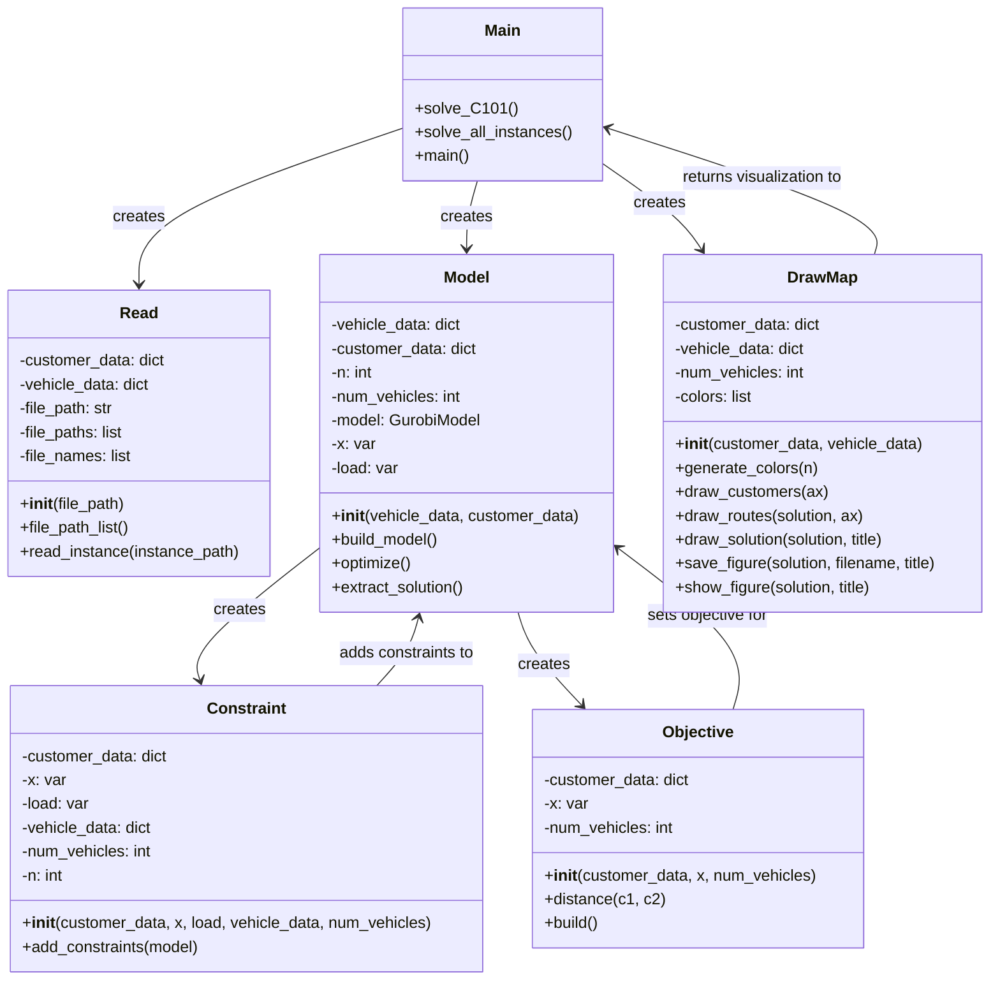

# 高级运筹学实验一：调用GUROBI求解VRPTW

谢奕飞 2024215060

## 概述

本项目实现了一个用于求解带时间窗的车辆路径规划问题(Vehicle Routing Problem with Time Windows, VRPTW)的解决方案。

该项目使用Python语言开发，采用GUROBI优化求解器来处理混合整数规划模型。

## 数学模型

### 符号说明

集合

- $$V$$: 节点集合，$$V = \{0,1,2,...,n\}$$，其中0表示配送中心
- $$K$$: 车辆集合，$$K = \{1,2,...,m\}$$

参数

- $$d_i$$: 客户点i的需求量
- $$Q$$: 车辆容量
- $$c_{ij}$$: 从节点i到节点j的行驶距离/成本
- $$t_{ij}$$: 从节点i到节点j的行驶时间
- $$s_i$$: 在客户点i的服务时间
- $$[e_i, l_i]$$: 客户点i的时间窗，$$e_i$$为最早服务时间，$$l_i$$为最晚服务时间
- $$M$$: 一个足够大的正数

决策变量

- $$x_{ijk}$$: 若车辆k从节点i行驶到节点j则为1，否则为0
- $$y_{ik}$$: 车辆k到达节点i时的载重量
- $$w_{ik}$$: 车辆k开始服务客户i的时间

### 目标函数

最小化总行驶距离：

$$
\min \sum_{k \in K} \sum_{i \in V} \sum_{j \in V} c_{ij} x_{ijk}
$$

### 约束条件

1. 客户访问约束：每个客户必须且只能被访问一次：

$$
\sum_{k \in K} \sum_{i \in V} x_{ijk} = 1 \quad \forall j \in V \setminus \{0\}
$$

2. 车辆流平衡约束：
   
   a. 每辆车必须从depot出发：
   $$
   \sum_{j \in V \setminus \{0\}} x_{0jk} \leq 1 \quad \forall k \in K
   $$
   
   b. 流入流出平衡：
   $$
   \sum_{i \in V} x_{ihk} = \sum_{j \in V} x_{hjk} \quad \forall h \in V, k \in K
   $$

3. 容量约束：

   a. 初始载重约束：
   $$
   y_{0k} = 0 \quad \forall k \in K
   $$
   
   b. 载重传播约束：
   $$
   y_{jk} \geq y_{ik} + d_j - M(1-x_{ijk}) \quad \forall i,j \in V, k \in K
   $$
   
   c. 载重上限约束：
   $$
   y_{ik} \leq Q \quad \forall i \in V, k \in K
   $$

4. 时间窗约束：

   a. 时间传播约束：
   $$
   w_{jk} \geq w_{ik} + s_i + t_{ij} - M(1-x_{ijk}) \quad \forall i,j \in V, k \in K
   $$
   
   b. 时间窗限制：
   $$
   e_i \leq w_{ik} \leq l_i \quad \forall i \in V \setminus \{0\}, k \in K
   $$

5. 变量取值约束：
   $$
   x_{ijk} \in \{0,1\} \quad \forall i,j \in V, k \in K
   $$
   $$
   y_{ik} \geq 0 \quad \forall i \in V, k \in K
   $$
   $$
   w_{ik} \geq 0 \quad \forall i \in V, k \in K
   $$

## 代码架构

项目采用面向对象的设计方法，主要包含以下核心模块：

1. 数据读取模块（Read.py）
   - 负责读取和解析问题实例数据
   - 支持批量读取多个实例文件
   - 提供数据预处理功能

2. 模型构建模块（Model.py）
   - 实现VRPTW的数学模型
   - 管理决策变量和模型参数
   - 协调约束条件和目标函数的添加

3. 约束处理模块（Constraint.py）
   - 实现所有必要的约束条件：
     - 客户访问约束
     - 车辆流平衡约束
     - 容量约束
     - 时间窗约束
   - 通过Gurobi接口添加约束条件

4. 目标函数模块（Objective.py）
   - 定义优化目标（最小化总行驶距离）
   - 实现距离计算功能
5. 绘制地图模块（DrawMap.py）
    - 将输出结果绘制成路径网络
    - 显示并保存图像



## 核心功能

### 数据管理
- 支持读取标准VRPTW数据集格式
- 解析车辆信息（数量、容量）和客户信息（位置、需求量、时间窗等）
- 实现数据有效性验证

### 约束建模
项目实现了VRPTW问题的所有关键约束：

- 客户访问约束：确保每个客户都被访问一次且仅一次
- 车辆流平衡约束：
  - 车辆从配送中心出发
  - 节点的流入流出平衡
- 容量约束：确保不超过车辆载重限制
- 时间窗约束：
  - 服务时间必须在客户指定的时间窗内
  - 考虑行驶时间和服务时间

### 优化目标
- 采用欧氏距离计算客户点之间的距离
- 目标函数为最小化所有车辆的总行驶距离

### 求解策略
- 使用Gurobi求解器求解混合整数规划模型
- 提供解的提取和结果输出功能
- 支持无可行解情况的处理
- 支持超时情况的处理

## 技术特点

1. 建模优化
   - 使用Big-M方法处理逻辑约束
   - 采用连续变量表示负载和时间，提高求解效率

2. 代码设计
   - 采用模块化设计，职责划分清晰
   - 良好的代码复用性和可维护性
   - 完整的异常处理机制

3. 扩展性
   - 支持不同规模的问题实例
   - 便于添加新的约束条件
   - 可以方便地修改目标函数

## 使用说明

1. 数据准备：
   - 在data目录下放置VRPTW问题实例文件
   - 文件格式需符合标准VRPTW数据集格式

2. 运行方式：
   ```python
   # 读取数据
   data = Read('data')
   vehicle_data, customer_data = data.read_instance(data.file_paths[0])
   
   # 创建和求解模型
   model = Model(vehicle_data, customer_data)
   model.build_model()
   solution = model.optimize()
   ```

3. 结果输出：
   - 程序会输出每辆车的具体路径
   - 包含从起点到终点的完整访问序列

## 运行环境

| 环境     | 型号                                   |              |
| -------- | -------------------------------------- | ------------ |
| 处理器   | AMD Ryzen 7 4800H with Radeon Graphics | 2.90 GHz     |
| 机带 RAM | 16.0 GB                                | 15.9 GB 可用 |
| 操作系统 | Windows 10 家庭中文版                  |              |
| 编程语言 | Python 3.10                            |              |

## 运行结果

以C101算例作为输入，得到以下结果：


```
D:\Project\OR_Experiment1\venv\Scripts\python.exe D:\Project\OR_Experiment1\main.py 
Gurobi Optimizer version 11.0.0 build v11.0.0rc2 (win64 - Windows 10.0 (19045.2))

CPU model: AMD Ryzen 7 4800H with Radeon Graphics, instruction set [SSE2|AVX|AVX2]
Thread count: 8 physical cores, 16 logical processors, using up to 16 threads

Optimize a model with 515200 rows, 260075 columns and 2272550 nonzeros
Model fingerprint: 0x3a99fb1b
Variable types: 5050 continuous, 255025 integer (255025 binary)
Coefficient statistics:
  Matrix range     [1e+00, 1e+03]
  Objective range  [1e+00, 1e+02]
  Bounds range     [1e+00, 1e+00]
  RHS range        [1e+00, 1e+03]
Presolve removed 195650 rows and 121425 columns
Presolve time: 2.99s
Presolved: 319550 rows, 138650 columns, 1226700 nonzeros
Variable types: 5000 continuous, 133650 integer (133650 binary)

Deterministic concurrent LP optimizer: primal simplex, dual simplex, and barrier
Showing barrier log only...

Root barrier log...

Ordering time: 0.27s

Barrier statistics:
 Dense cols : 108
 AA' NZ     : 1.837e+05
 Factor NZ  : 1.196e+06 (roughly 17 MB of memory)
 Factor Ops : 5.914e+08 (less than 1 second per iteration)
 Threads    : 5

                  Objective                Residual
Iter       Primal          Dual         Primal    Dual     Compl     Time
   0   8.75379754e+07 -4.96307541e+06  2.24e+04 7.39e+01  1.16e+05     6s
   1   3.83951267e+07 -1.04871998e+08  9.82e+03 1.56e-10  4.91e+04     6s
   2   1.15667582e+07 -8.62433212e+07  2.96e+03 6.71e-11  1.56e+04     6s
   3   1.65902805e+06 -4.33506735e+07  4.24e+02 4.69e-11  3.06e+03     6s
   4   7.11980496e+04 -3.37645117e+06  1.71e+01 2.57e-11  1.74e+02     6s
   5   1.27750700e+04 -8.86984155e+05  2.26e+00 6.73e-12  4.11e+01     6s
   6   7.55147697e+03 -3.81799670e+05  9.36e-01 2.92e-12  1.74e+01     6s
   7   5.18080003e+03 -2.18026631e+05  2.99e-01 1.64e-12  9.66e+00     6s
   8   3.97696564e+03 -5.41684670e+04  5.55e-04 9.49e-13  2.45e+00     6s
   9   3.71802616e+03 -2.62829026e+04  3.09e-04 6.18e-13  1.26e+00     7s
  10   3.02364623e+03 -1.86715282e+04  9.32e-05 6.07e-13  9.13e-01     7s
  11   1.99703073e+03 -3.32832782e+03  2.69e-05 4.04e-13  2.24e-01     7s
  12   1.51721659e+03 -9.86003794e+02  1.39e-05 4.24e-13  1.05e-01     7s
  13   1.02565769e+03 -5.35890902e+01  3.68e-06 3.67e-13  4.54e-02     7s
  14   8.26063760e+02  7.53862010e+02  4.53e-08 5.53e-13  3.04e-03     7s
  15   8.19122844e+02  8.18593502e+02  1.94e-14 7.71e-13  2.23e-05     7s
  16   8.19007650e+02  8.19007118e+02  1.27e-11 3.04e-13  2.24e-08     7s
  17   8.19007534e+02  8.19007534e+02  1.26e-14 6.35e-13  2.24e-11     7s
  18   8.19007534e+02  8.19007534e+02  3.55e-15 4.86e-13  2.24e-14     7s

Barrier solved model in 18 iterations and 6.72 seconds (6.88 work units)
Optimal objective 8.19007534e+02


Root crossover log...

      92 DPushes remaining with DInf 0.0000000e+00                 7s
       0 DPushes remaining with DInf 0.0000000e+00                 7s

      47 PPushes remaining with PInf 0.0000000e+00                 7s
       0 PPushes remaining with PInf 0.0000000e+00                 7s

  Push phase complete: Pinf 0.0000000e+00, Dinf 5.0270899e-13      7s


Root simplex log...

Iteration    Objective       Primal Inf.    Dual Inf.      Time
     142    8.1900753e+02   0.000000e+00   0.000000e+00      7s
     142    8.1900753e+02   0.000000e+00   0.000000e+00      7s

Use crossover to convert LP symmetric solution to basic solution...
Concurrent spin time: 0.07s

Solved with dual simplex

Root relaxation: objective 8.190075e+02, 3295 iterations, 1.98 seconds (1.01 work units)

    Nodes    |    Current Node    |     Objective Bounds      |     Work
 Expl Unexpl |  Obj  Depth IntInf | Incumbent    BestBd   Gap | It/Node Time

     0     0  819.00753    0   60          -  819.00753      -     -    8s
H    0     0                    1388.4410428  819.00753  41.0%     -    9s
H    0     0                    1147.8620179  819.00753  28.6%     -   12s
     0     0  819.00753    0  169 1147.86202  819.00753  28.6%     -   15s
H    0     0                     891.2201741  819.00753  8.10%     -   31s
     0     0  819.00753    0  259  891.22017  819.00753  8.10%     -   32s
     0     0  819.00753    0   59  891.22017  819.00753  8.10%     -   36s
H    0     0                     890.8326103  819.00753  8.06%     -   38s
     0     0  819.00753    0   61  890.83261  819.00753  8.06%     -   38s
     0     0  819.00753    0   59  890.83261  819.00753  8.06%     -   43s
     0     0  819.00753    0   59  890.83261  819.00753  8.06%     -   45s
     0     0  819.00753    0   59  890.83261  819.00753  8.06%     -   49s
     0     0  819.00753    0   63  890.83261  819.00753  8.06%     -   51s
     0     0  819.00753    0   59  890.83261  819.00753  8.06%     -   55s
     0     0  819.00753    0   63  890.83261  819.00753  8.06%     -   56s
     0     0  819.00753    0   59  890.83261  819.00753  8.06%     -   61s
     0     0  819.00753    0   59  890.83261  819.00753  8.06%     -   63s
H    0     0                     889.5063946  821.56427  7.64%     -   73s
     0     0  821.56427    0   59  889.50639  821.56427  7.64%     -   83s
     0     0  821.56427    0  119  889.50639  821.56427  7.64%     -   87s
H    0     0                     828.9368669  821.56427  0.89%     -   94s
     0     0  821.56427    0  147  828.93687  821.56427  0.89%     -   95s
     0     0  821.56427    0  199  828.93687  821.56427  0.89%     -   97s
     0     0     cutoff    0       828.93687  828.93687  0.00%     -  105s

Explored 1 nodes (43037 simplex iterations) in 105.70 seconds (108.90 work units)
Thread count was 16 (of 16 available processors)

Solution count 6: 828.937 889.506 890.833 ... 1388.44

Optimal solution found (tolerance 1.00e-04)
Best objective 8.289368669428e+02, best bound 8.289368669428e+02, gap 0.0000%
Solution found:
Vehicle 0 route:
  0 -> 13
  12 -> 0
  13 -> 17
  14 -> 12
  15 -> 16
  16 -> 14
  17 -> 18
  18 -> 19
  19 -> 15
Vehicle 1 route:
Vehicle 2 route:
Vehicle 3 route:
  0 -> 43
  40 -> 44
  41 -> 40
  42 -> 41
  43 -> 42
  44 -> 46
  45 -> 48
  46 -> 45
  47 -> 0
  48 -> 51
  49 -> 47
  50 -> 52
  51 -> 50
  52 -> 49
Vehicle 4 route:
  0 -> 32
  31 -> 35
  32 -> 33
  33 -> 31
  34 -> 0
  35 -> 37
  36 -> 34
  37 -> 38
  38 -> 39
  39 -> 36
Vehicle 5 route:
Vehicle 6 route:
  0 -> 90
  82 -> 84
  83 -> 82
  84 -> 85
  85 -> 88
  86 -> 83
  87 -> 86
  88 -> 89
  89 -> 91
  90 -> 87
  91 -> 0
Vehicle 7 route:
Vehicle 8 route:
Vehicle 9 route:
  0 -> 81
  70 -> 73
  71 -> 70
  73 -> 77
  76 -> 71
  77 -> 79
  78 -> 76
  79 -> 80
  80 -> 0
  81 -> 78
Vehicle 10 route:
Vehicle 11 route:
  0 -> 57
  53 -> 56
  54 -> 53
  55 -> 54
  56 -> 58
  57 -> 55
  58 -> 60
  59 -> 0
  60 -> 59
Vehicle 12 route:
Vehicle 13 route:
Vehicle 14 route:
Vehicle 15 route:
Vehicle 16 route:
  0 -> 5
  1 -> 75
  2 -> 1
  3 -> 7
  4 -> 2
  5 -> 3
  6 -> 4
  7 -> 8
  8 -> 10
  9 -> 6
  10 -> 11
  11 -> 9
  75 -> 0
Vehicle 17 route:
Vehicle 18 route:
Vehicle 19 route:
Vehicle 20 route:
Vehicle 21 route:
Vehicle 22 route:
  0 -> 67
  61 -> 64
  62 -> 74
  63 -> 62
  64 -> 68
  65 -> 63
  66 -> 69
  67 -> 65
  68 -> 66
  69 -> 0
  72 -> 61
  74 -> 72
Vehicle 23 route:
  0 -> 98
  92 -> 93
  93 -> 97
  94 -> 92
  95 -> 94
  96 -> 95
  97 -> 100
  98 -> 96
  99 -> 0
  100 -> 99
Vehicle 24 route:
  0 -> 20
  20 -> 24
  21 -> 0
  22 -> 21
  23 -> 22
  24 -> 25
  25 -> 27
  26 -> 23
  27 -> 29
  28 -> 26
  29 -> 30
  30 -> 28

进程已结束，退出代码为 0

```


## 总结

本项目通过面向对象的设计方法，实现了一个完整的VRPTW问题求解框架。项目结构清晰，具有良好的可扩展性和可维护性。通过使用Gurobi优化求解器，能够有效求解中小规模的VRPTW问题实例。该项目为物流配送路径优化提供了一个可靠的解决方案，同时也为进一步的优化和扩展提供了良好的基础。